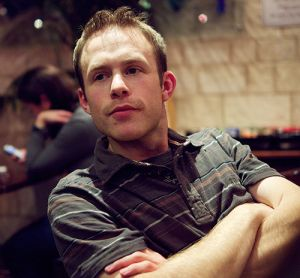

{:id="mainmugshot"}

I am a Lecturer in the [Real-Time Systems Group](http://www.cs.york.ac.uk/rts/) at the [University of York](http://www.york.ac.uk/). My work is centred around real-time, embedded systems, and particularly the use of new programming models and techniques to help the development of systems with complex hardware architectures.

For details on undergraduate project supervision, [see my project allocation homepage](https://www.cs.york.ac.uk/projects/allocation/supervisor/iang/).

I have published [many papers and articles](publications.html) as part of my work and in conjunction with a number of EU research projects.
